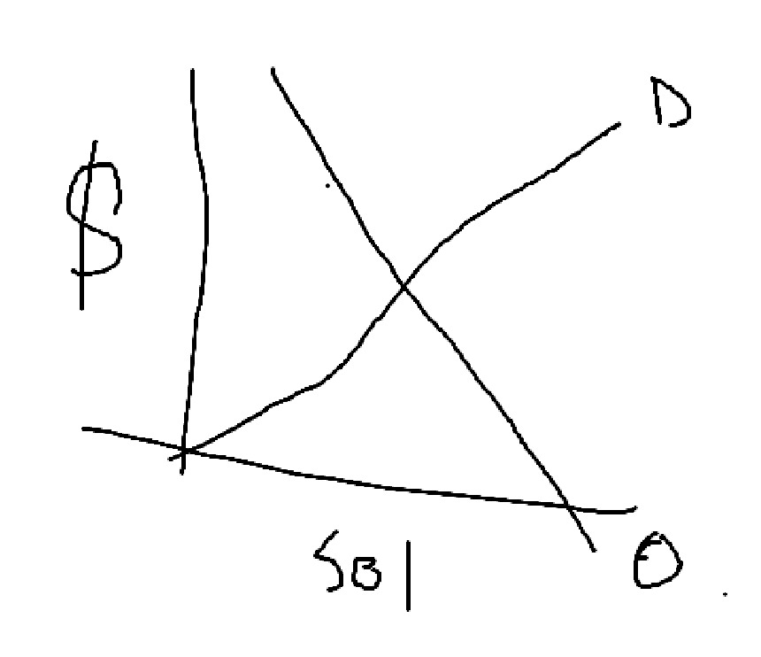

# Streger Solar — Análisis CFE ☀️

**Herramienta de viabilidad fotovoltaica y de respaldo para clientes industriales bajo tarifas CFE GDMTO / GDMTH**
Tecnológico de Monterrey — Programación para Ingeniería · Equipo 4

---

## Descripción

Aplicación **Streamlit** para evaluar la viabilidad técnica y económica de un sistema fotovoltaico (FV) —y, opcionalmente, de un banco de baterías— para clientes industriales de la Comisión Federal de Electricidad (CFE) en México.

La herramienta soporta dos tarifas de gran demanda en media tensión:

- **GDMTO** (Gran Demanda en Media Tensión **Ordinaria**) — tarifa plana, sin horarios. Es el **flujo principal** y vive en la página de inicio (`app/main.py`). Está calibrada contra un recibo real de **Streger S.A., Coatepec, Veracruz (Mayo 2026)**.
- **GDMTH** (Gran Demanda en Media Tensión **Horaria**) — tarifa con periodos Punta / Intermedia / Base. Es el flujo secundario y vive en las páginas del menú lateral, detrás del selector de tarifa.

El modo se elige con el radio **⚡ Modo tarifario** en la barra lateral (`session_state["tariff_mode"]`).

### Características principales

- Modelo de irradiancia **isótropo (Jensen)** vía **pvlib**, con tres fuentes de clima:
  - **Cielo despejado** (Ineichen-Perez),
  - **Estocástica** — variabilidad de nubosidad AR(1) anclada a la climatología de turbidez Linke del sitio (semilla fija → reproducible),
  - **NSRDB** — TMY real de NREL (PSM4, requiere API key gratuita).
- Derating térmico real por **NOCT** y coeficiente de potencia del fabricante.
- Catálogo de **paneles Tier 1**: Jinko, LONGi, Trina, Canadian Solar.
- Catálogo de **baterías LiFePO4 / NMC**: BYD, Pylontech, Sungrow, Tesla, Huawei.
- **GDMTO:** captura de recibos, balance demanda vs generación, evaluación Módulo Express o desglose formal de factura (energía + capacidad + distribución + 2% pérdidas BT + ajuste por factor de potencia + IVA).
- **GDMTH:** análisis horario, *peak shaving* con despacho de baterías y optimización por VPN.
- **Resiliencia ante apagones:** dimensionamiento automático de banco de respaldo (BESS) por energía y potencia de la carga crítica.
- **Modelo financiero:** VPN, TIR, periodo de recuperación, LCOE, degradación de paneles, O&M, y trade-offs técnicos (enfriamiento activo vs paneles extra, FV vs BESS).
- ~33 capitales de estado precargadas + coordenadas personalizadas y mapa interactivo (folium).
- Exportación de gráficas y reportes a **Excel** y **PDF**.

---

## Instalación y ejecución

### Requisitos previos
- Python 3.11+
- Git

### Windows (PowerShell)
```powershell
cd Streger
.\run.ps1
```

### Linux / macOS
```bash
cd Streger
bash run.sh
```

Ambos scripts crean el entorno virtual `.venv`, instalan dependencias y lanzan la app con el tema de la marca.

### Manual (cualquier plataforma)
```bash
# 1. Crear y activar entorno virtual
python -m venv .venv
# Windows:
.venv\Scripts\activate
# Linux/Mac:
source .venv/bin/activate

# 2. Instalar dependencias
pip install -r requirements.txt

# 3. Ejecutar
streamlit run app/main.py
```

La app abre en **http://localhost:8501**

---

## Estructura del proyecto

```
Streger/
├── app/
│   ├── main.py                       # Entrada Streamlit + flujo PRINCIPAL GDMTO (Secciones 1–4)
│   ├── pages/                        # Flujo GDMTH (horario) + equipo
│   │   ├── 1_team.py                 # Información del equipo + abstract
│   │   ├── 2_config.py              # Configuración panel / batería / ubicación (mapa)
│   │   ├── 3_solar.py              # Modelo Jensen, POA, generación FV, cadena de pérdidas
│   │   ├── 4_demand.py            # Curva de carga + inyección solar
│   │   ├── 5_baterias.py        # Despacho / peak shaving + respaldo
│   │   └── 6_economics.py     # ROI, flujo de caja y trade-offs tecnológicos
│   ├── core/
│   │   ├── jensen.py            # Modelo isótropo pvlib + clima (clearsky/estocástico/NSRDB)
│   │   ├── gdmto.py            # Calculadora tarifa GDMTO (plana, calibrada al recibo real)
│   │   ├── gdmth.py           # Calculadora tarifa GDMTH (horaria)
│   │   ├── battery.py        # Despacho de baterías y optimización GDMTH por VPN
│   │   ├── resilience.py    # Dimensionamiento de BESS de respaldo (GDMTO)
│   │   ├── pv_finance.py   # VPN/TIR/LCOE, degradación, O&M, trade-offs
│   │   ├── residential.py # Modelo residencial auxiliar
│   │   ├── plots.py      # Constructores Plotly (funciones puras)
│   │   ├── exporting.py # Exportación de gráficas (Excel/PDF)
│   │   └── state.py    # Persistencia de session_state entre páginas
│   ├── utils/
│   │   └── theming.py # Tema de marca + métricas personalizadas
│   ├── assets/styles.css
│   └── data/
│       ├── panels.json                 # Catálogo paneles Tier 1
│       ├── batteries.json             # Catálogo baterías
│       ├── tariff_gdmth.json         # Tarifas GDMTH por región y temporada
│       ├── tariff_gdmto_streger.json # Tarifa GDMTO calibrada (Streger, Coatepec)
│       └── sample_load.csv           # Curva de carga industrial de muestra
├── tests/                          # 78 pruebas (pytest), incl. smoke con AppTest
├── requirements.txt
├── run.ps1                       # Script de inicio Windows
├── run.sh                       # Script de inicio Linux/Mac
└── README.md
```

---

## Flujo GDMTO (página principal)

1. **Sección 1 — Vista Rápida:** ubicación, inclinación/azimut e irradiancia de un día representativo (equinoccio, cielo despejado), con generación estimada por panel.
2. **Sección 2 — Tu consumo CFE:** captura de recibos (promedio mensual o tabla de 12 meses), sistema FV propuesto y balance mensual demanda vs generación (con nubosidad estocástica y derating térmico).
3. **Sección 3 — Resiliencia ante apagones:** dimensiona el banco de baterías para una carga crítica y una duración de respaldo dadas; propone la opción de menor CAPEX que cumple energía y potencia.
4. **Sección 4 — Evaluación económica:** rentabilidad del FV (Módulo Express o desglose formal GDMTO) con TIR/VPN/payback, y análisis de continuidad de negocio (batería ± FV vs costo histórico de apagones).

---

## Metodología

## Modelo económico



### Modelo de irradiancia Jensen (isótropo difuso)

El modelo asume distribución uniforme (isótropa) de la radiación difusa del cielo. La irradiancia en el plano del panel (POA) se calcula como:

$$G_{POA} = G_b \cdot R_b + G_{dh} \cdot \frac{1+\cos\beta}{2} + G_{gh} \cdot \rho \cdot \frac{1-\cos\beta}{2}$$

donde:
- $G_b$ = irradiancia directa (beam) horizontal
- $R_b$ = factor geométrico beam (función del ángulo solar y orientación del panel)
- $G_{dh}$ = irradiancia difusa horizontal
- $\beta$ = ángulo de inclinación del panel
- $G_{gh}$ = irradiancia global horizontal
- $\rho$ = albedo del suelo (default 0.25)

**Cielo claro:** modelo Ineichen-Perez implementado en pvlib.
**Nubosidad:** modelo estocástico AR(1) cuyo índice de claridad medio mensual se deriva de la climatología de turbidez Linke del sitio (offline). Opcionalmente, datos TMY reales vía NREL NSRDB (PSM4).

**Referencia:** Jensen, A. R., Anderson, K. S., Holmgren, W. F., Mikofski, M. A., Hansen, C. W., Boeman, L. J., & Loonen, R. (2023). *pvlib iotools—Open-source Python functions for seamless access to solar irradiance data.* Solar Energy, 266, 112092.
[DOI: 10.1016/j.solener.2023.112092](https://doi.org/10.1016/j.solener.2023.112092)

### Temperatura de celda y generación

$$T_{cell} = T_{amb} + (NOCT - 20) \cdot \frac{G_{POA}}{800}$$

La potencia se derata por temperatura usando el coeficiente $\alpha_{Pmax}$ del fabricante y la eficiencia del inversor (0.96):

$$P_{ac} = G_{POA} \cdot A_{total} \cdot \eta_{panel} \cdot [1 + \alpha_{Pmax}(T_{cell} - 25)] \cdot \eta_{inv}$$

La energía se integra como $E = \sum_i P_i \cdot \Delta t$ (Δt = 1 h horario, 0.25 h quinceminutal).

### Tarifa GDMTO (flujo principal)

Tarifa plana, sin periodos horarios, calibrada al recibo real de Streger (Coatepec, Mayo 2026):

| Componente | Base de facturación | Unidad |
|------------|---------------------|--------|
| **Cargo fijo** | mensual | MXN/mes |
| **Energía** | kWh consumidos (energía + transmisión + CENACE + SCnMEM) | MXN/kWh |
| **Capacidad** | demanda facturable | MXN/kW/mes |
| **Distribución** | demanda facturable | MXN/kW/mes |
| **Pérdidas BT** | 2% sobre cargos | % |
| **Factor de potencia** | recargo si FP < 90% / bonificación si FP > 90% | % |
| **IVA** | sobre el subtotal | 16% |

### Tarifa GDMTH (flujo secundario)

Tarifa horaria con tres periodos de energía (Punta, Intermedia, Base) y cargos de capacidad y distribución. Dos temporadas:
- **Verano:** 1er domingo de abril → sábado previo al último domingo de octubre.
- **Invierno:** último domingo de octubre → sábado previo al 1er domingo de abril.

Bajo GDMTH, la batería se justifica por *peak shaving* (descargar en Punta, recargar en Base o con excedente FV); bajo GDMTO, por **continuidad operativa** (respaldo ante apagones).

---

## Datos de entrada

### Captura de consumo (GDMTO)
Se ingresan directamente en la app: consumo mensual (kWh), demanda máxima (kW), factor de potencia (%) y costo medio del recibo ($/kWh) — como promedio o tabla de 12 meses.

### Curva de carga (GDMTH, CSV)
```csv
timestamp,demand_kw
2024-01-01 00:00:00,185.3
2024-01-01 01:00:00,172.1
...
```
- Resolución: **horaria**
- Valores: potencia activa en kW
- Mínimo recomendado: 1 mes (744 filas)

Hay una curva de muestra en `app/data/sample_load.csv`.

---

## Pruebas

El proyecto incluye **78 pruebas** (pytest) que cubren las calculadoras tarifarias, el dimensionamiento de baterías, los modelos financieros y un *smoke test* que ejecuta las páginas reales con `streamlit.testing.v1.AppTest`.

```powershell
# Con el venv del proyecto (Windows)
& ".venv\Scripts\python.exe" -m pytest tests/ -q
```
```bash
# Linux/Mac
.venv/bin/python -m pytest tests/ -q
```

`tests/conftest.py` agrega `app/` al `sys.path` para que los imports `core.*` funcionen igual que en las páginas.

---

## Convenciones

- **Idioma:** etiquetas y textos de la interfaz en **español**; código, comentarios y mensajes de commit en **inglés**.
- **Moneda:** MXN formateada como `$ {:,.2f}`.
- Los constructores de gráficas en `core/plots.py` son **funciones puras** (sin Streamlit), por lo que son testeables.

---

## Dependencias principales

| Paquete | Versión | Uso |
|---------|---------|-----|
| streamlit | ≥1.35 | Interfaz web |
| pvlib | ≥0.11 | Modelo solar Jensen + NSRDB |
| pandas | ≥2.2 | Procesamiento de datos |
| numpy | ≥1.26 | Cálculo numérico |
| plotly | ≥5.22 | Visualizaciones interactivas |
| scipy | ≥1.13 | Soporte numérico |
| folium / streamlit-folium | ≥0.17 / ≥0.20 | Mapa interactivo de ubicación |
| openpyxl | ≥3.1 | Exportación Excel |
| reportlab | ≥4.2 | Generación de PDF |
| requests | ≥2.31 | Acceso a NSRDB |
| pytest | ≥8.0 | Pruebas |

---

## Licencia

Proyecto académico — Tecnológico de Monterrey. Solo para fines educativos.
</content>
</invoke>
